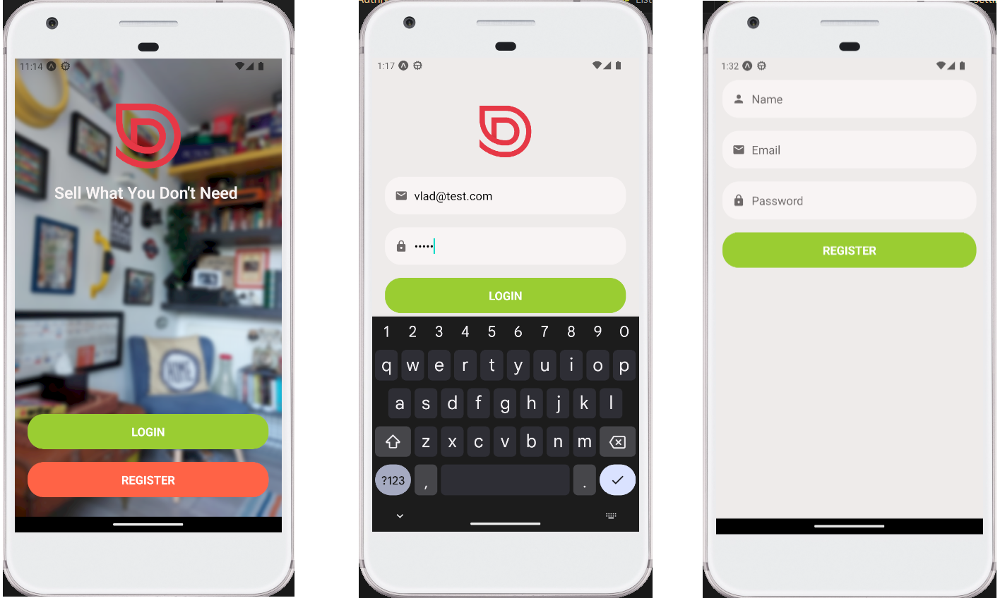

# DoneWithIt

Done With It is a mobile app that helps you sell all your used stuff, it emulates a "garage sale" in the virtual world, allowing users to register and post their listings with a fixed price, it also provides user with notifications whenever a new offer or message is received.

## Getting Started

- Backend Setup

1. Clone the backend code located at https://github.com/noomdalv/DoneWithIt-BackEnd
2. Update ./config/{env}.json with your ip
3. Run `npm install` to install the required dependencies.
4. Run `npm run start` to run the backend web server.

- FrontEnd Setup

1. Clone this repository to your local machine.
2. Run `npm install` to install the required dependencies.
3. Run `npm run start` to run expo client.

## About / Info

- Properly file structured React Native project
- Work with core components and APIs
- Build complex layouts with Flexbox
- Build forms with Formik
- Implement data validation with Yup
- Applied industry best practices

Special mention to @Mosh Hamedani and his react mobile course which this project was based from.
